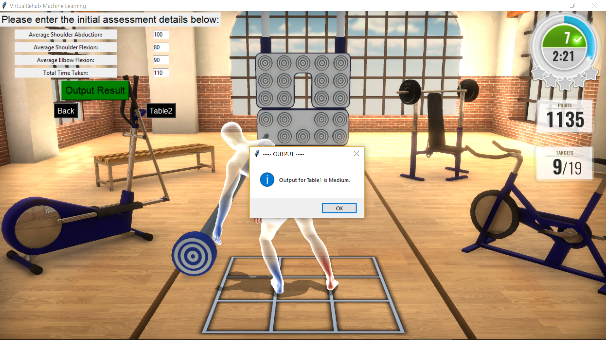

# Machine Learning Models and Application
The Machine Models and GUI Application made for Evolv Rehabilitation Technologies. Five Jupyter Notebooks are created that use machine learning methodologies on patient data created by Evolv. The results are compiled into a GUI application that, given input data, optimally classifies a patient into their optimal motion-based game starting difficiulty level, in order to begin an effective post-stroke rehabilitation programme.

This repository incldues the input data, five Jupyter Notebooks (of which Table1 and Table2 create the optimal models, and the rest explore further advanced machine learning techniques), the optimally trained Pickled models, and a GUI application.

The following Python packages and libraries are used, and need to be installed before the code is run on a local machine: numpy, pandas, matplotlib, seaborn, scikit-learn, xgboost, scikit-plot, pydot, mord, mlxtend, hyperopt, joblib, tkinter, and pillow. 

Screenshots of the application:

 

